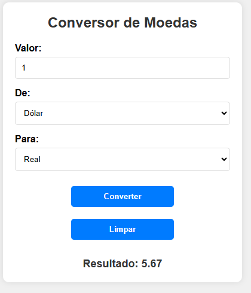

# Conversor de moedas
 
## Introdução
 
Este projeto é um Conversor de Moedas desenvolvido para a disciplina de Programação Web, com o objetivo de permitir que o usuário insira um valor em uma moeda e o converta para outra, utilizando taxas de câmbio pré-definidas no código. O sistema foi construído utilizando HTML5, CSS3 e JavaScript puro, sem consumo de APIs externas. A interface é simples e responsiva, garantindo uma boa experiência tanto em computadores quanto em dispositivos móveis.
A aplicação permite que o usuário:
 
• Insira um valor para conversão.
 
• Escolha uma moeda de origem e uma moeda de destino.
 
• Converta o valor instantaneamente utilizando taxas fixas definidas no código.
 
• Limpe os campos para realizar uma nova conversão.
 
Este projeto foi estruturado seguindo boas práticas de organização do código e separação entre lógica (JavaScript), estrutura (HTML) e estilo (CSS).
 

## Funcionalidades
 
O JavaScript implementa a lógica para:
1. Realizar a conversão das moedas com base em taxas fixas.
 
2. Verificar se o valor inserido é válido.
 
3. Resetar os campos para uma nova conversão.
 
Trechos e explicações do código JavaScript:
 
- document.getElementById('currency-form').addEventListener('submit', function(e) {
    e.preventDefault();  // Evita que a página recarregue ao enviar o formulário
 
    Este evento impede o recarregamento da página ao clicar no botão de converter, garantindo que o cálculo seja feito dinamicamente.
    

 
- const amount = parseFloat(document.getElementById('amount').value);
    const fromCurrency = document.getElementById('from-currency').value;
    const toCurrency = document.getElementById('to-currency').value;
 
    Essas linhas capturam o valor inserido e as moedas selecionadas pelo usuário.
    

 
- const exchangeRates = {
    usd: { brl: 5.05, eur: 0.94 },
    eur: { usd: 0.07, brl: 5.40 },
    brl: { usd: 0.20, eur: 0.19 }
};
     As taxas de câmbio fixas estão definidas aqui. Por exemplo, 1 Dólar = 5,05 Reais.
     

 
 - if (isNaN(amount) || amount <= 0) {
    document.getElementById('result').textContent = 'Por favor, insira um valor válido.';
    return;
}
    Verifica se o valor inserido é válido (não pode ser negativo ou nulo).
    

 
 
- let convertedAmount;
if (fromCurrency === toCurrency) {
    convertedAmount = amount;  // Se as moedas forem iguais, o valor não muda
} else {
    convertedAmount = amount * exchangeRates[fromCurrency][toCurrency];
}
    Realiza a conversão multiplicando o valor pela taxa correspondente. Se a moeda de origem for a mesma que a de destino, o valor permanece inalterado.
    

 
 
- document.getElementById('result').textContent = `Resultado: ${convertedAmount.toFixed(2)}`;
 
    Exibe o resultado da conversão com duas casas decimais.
    

 
 
- document.getElementById('reset-button').addEventListener('click', function() {
    document.getElementById('amount').value = '';
    document.getElementById('from-currency').selectedIndex = 0;
    document.getElementById('to-currency').selectedIndex = 0;
    document.getElementById('result').textContent = '';
});
 
    Este trecho define a funcionalidade do botão "Limpar", que reseta todos os campos do formulário.
 
## Fontes consultadas:
 
- [Site base de conversão de moedas](https://www.bcb.gov.br/conversao)
 
 
 ## Tecnologias utilizadas:
- Visual Studio Code
 - Github
 - Git
 - HTML5
 - CSS3
 - Javascript
 
  ## Autores:
- [Nicolas Tonassi](https://github.com/nicolas-tonassi)
- [Naillim Novaski](https://github.com/naillimnovaski)
